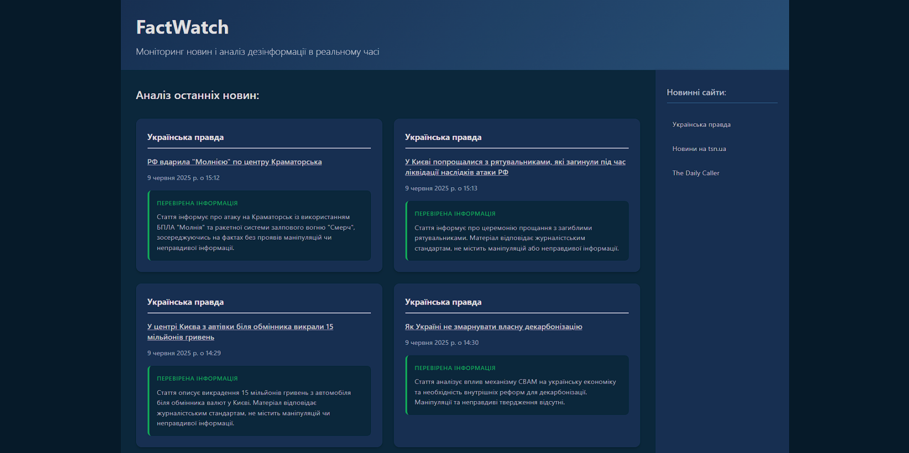

# Аналізатор новин: Боротьба з дезінформацією та маніпуляціями в ЗМІ

 ## Про проєкт

Цей проєкт є автоматизованим інструментом для аналізу новинних матеріалів з українських та іноземних джерел. Його основна мета — виявляти потенційну дезінформацію, маніпуляції, упередженість та клікбейт, надаючи користувачам об'єктивну оцінку інформації. Проєкт створений з метою демонстрації навичок у веб-розробці, роботі з API, обробці даних та автоматизації.

## Демонстрація (Live Demo)

Перегляньте проєкт у дії: [https://madilyar.github.io/news_checker/](https://madilyar.github.io/news_checker/) ## Ключові функції

* **Автоматичний аналіз новин:** використання передових моделей штучного інтелекту (Google Gemini API) для аналізу змісту новин.
* **Виявлення маніпуляцій:** ідентифікація ознак упередженості, спотворення фактів, емоційного маніпулювання.
* **Визначення дезінформації:** виявлення неправдивих тверджень та фейків.
* **Оцінка клікбейту:** визначення заголовків, що вводять в оману або перебільшують.
* **Рівень ризику:** кожна новина отримує загальний рівень ризику (наприклад, "Перевірена інформація", "Маніпуляція", "Дезінформація").
* **Фільтрація новин:** відображення 6 останніх новин з вибраного джерела.
* **Зручний інтерфейс:** інтуїтивно зрозумілий та адаптивний дизайн для зручного перегляду на різних пристроях.

## Використані технології та інструменти

* **Python:**
    * Парсинг новин (збір даних).
    * Взаємодія з Gemini API для аналізу тексту.
    * Робота з базами даних (SQLite3).
    * Обробка та підготовка даних.
* **Бази даних:**
    * **SQLite3:** Для зберігання та керування даними про новини та їх аналіз.
* **JavaScript (ES6+):**
    * Динамічна підзавантаження та відображення даних з JSON.
    * Маніпуляції з DOM.
    * Реалізація інтерактивного інтерфейсу та фільтрації.
* **HTML5:**
    * Структурування веб-сторінок.
* **CSS3:**
    * Стилізація та адаптивний дизайн.
* **Git & GitHub:**
    * Система контролю версій.
    * Хостинг коду.
    * **GitHub Pages:** Розгортання статичного веб-сайту.
    * **GitHub Actions (планується/реалізовано):** Автоматизація процесу збору, аналізу, експорту та деплою новин. ## Як це працює (Архітектура)

1.  **Збір даних (Python):** Python-скрипт збирає нові статті з визначених джерел.
2.  **Аналіз (Python + Gemini API):** Кожна зібрана стаття відправляється до Google Gemini API для глибокого аналізу на наявність дезінформації, маніпуляцій, клікбейту, а також для отримання загального резюме та оцінки об'єктивності.
3.  **Зберігання (SQLite):** Результати аналізу зберігаються в локальній базі даних SQLite (`news.db`).
4.  **Експорт в JSON (Python):** Python-скрипт експортує останні 12 (або іншу задану кількість) проаналізованих новин у файл `data/news.json`. Це дозволяє фронтенду швидко завантажувати дані без прямого доступу до БД.
5.  **Відображення (HTML/CSS/JS):** Веб-сторінка на HTML/CSS/JavaScript завантажує `data/news.json` і динамічно відображає 6 найновіших новин у зручному форматі, використовуючи ваші власні CSS-стилі та інтерактивні елементи.

## План подальшого розвитку

* Розширення кількості джерел новин.
* Реалізація розширеної фільтрації та пошуку на фронтенді (можливо, з використанням бекенду).
* Додавання інтерактивних графіків та дашбордів для візуалізації даних.
* Покращення UX/UI дизайну.
* Впровадження повного CI/CD пайплайну за допомогою GitHub Actions.
* Можливість для користувачів залишати відгуки або пропонувати джерела.

## Контакти

* **Моє ім'я:** [Maksym]
* **Мій email:** [madilyarfernus@gmail.com]

---
